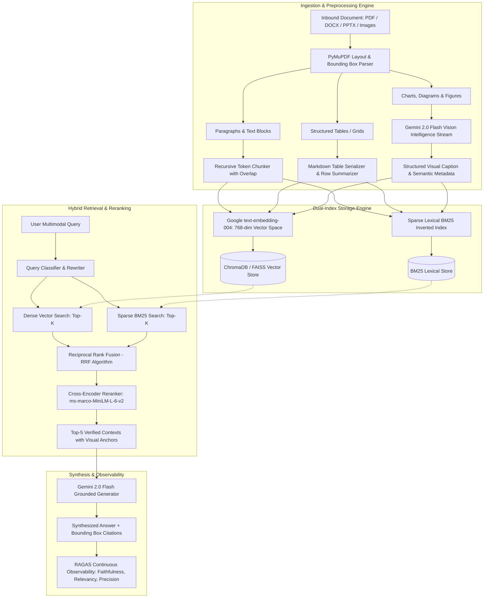

# Multimodal RAG Document Intelligence Platform - Architecture Design

## Executive Overview
The **Multimodal RAG Document Intelligence Platform** is engineered to unify textual, tabular, and visual information into a singular semantic retrieval graph. Unlike conventional text-only RAG pipelines that degrade when handling diagrams, multi-column tables, or complex PDF layouts, this system treats every visual artifact as a first-class citizen.

---

## 1. Dual-Path Feature Extraction & Layout Segmentation

### 1.1 Text & Layout Parsing
Documents are parsed into block elements retaining bounding box coordinates $(x_0, y_0, x_1, y_1)$ and page indices. This enables pixel-accurate visual highlighting when a user inspects a citation.

### 1.2 Table Serialization
Tables are converted into dual representations:
- **Markdown Tables**: Retain structural column relationships for precise numerical reasoning.
- **Natural Language Row Summaries**: Ensure semantic embeddings capture domain relationships (e.g., *"In Q3 2024, operating income was $6.4M at 41.2% net margin"*).

### 1.3 Vision Intelligence Stream
High-resolution crops of charts, diagrams, and figures are processed through **Gemini 2.0 Flash** with a specialized prompt extracting:
- Diagram archetype (flowchart, bar chart, line graph, architecture schematic)
- Key data series and numerical values
- Inferred relationships and architectural semantics

---

## 2. Hybrid Retrieval with Reciprocal Rank Fusion (RRF)

Standard vector retrieval often struggles with exact SKU numbers, dates, and domain codes, while sparse BM25 struggles with synonymy and abstract queries. This platform fuses both retrieval modalities:

$$RRF\_Score(d \in D) = \sum_{m \in \{dense, sparse\}} w_m \cdot \frac{1}{k + rank_m(d)}$$

Where:
- $k = 60$ (smoothing constant preventing high ranks from dominating)
- $w_{dense} = 0.7$ (semantic weight)
- $w_{sparse} = 0.3$ (lexical weight)

---

## 3. Cross-Encoder Reranking
Top candidates from RRF pass through a cross-encoder model (`cross-encoder/ms-marco-MiniLM-L-6-v2`). Unlike bi-encoders which process query and document independently, the cross-encoder computes all-to-all cross-attention between query tokens and document tokens, eliminating false-positive lexical overlaps.

---

## 4. RAGAS Quality Metrics

| Metric | Target | Description |
| :--- | :--- | :--- |
| **Faithfulness** | $\ge 90.0\%$ | Factual grounding in retrieved contexts (prevents hallucinations) |
| **Answer Relevancy** | $\ge 85.0\%$ | Direct answerability of user's core intent |
| **Context Precision** | $\ge 80.0\%$ | Signal-to-noise ratio in retrieved context blocks |
| **Context Recall** | $\ge 80.0\%$ | Coverage of ground-truth information required to answer |
| **Hallucination Rate** | $\le 5.0\%$ | Extrapolations not supported by source evidence |
